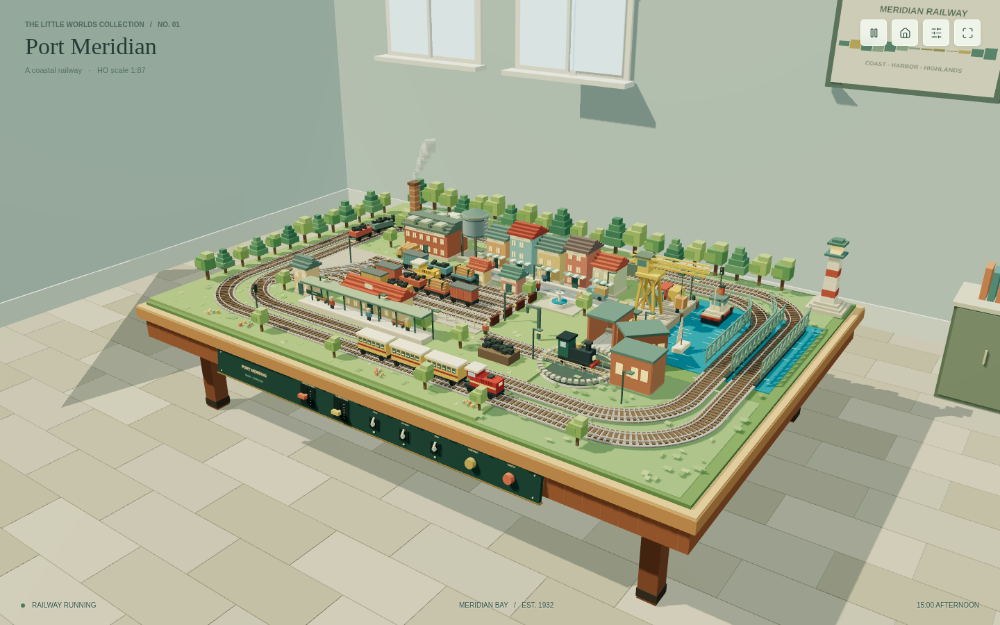
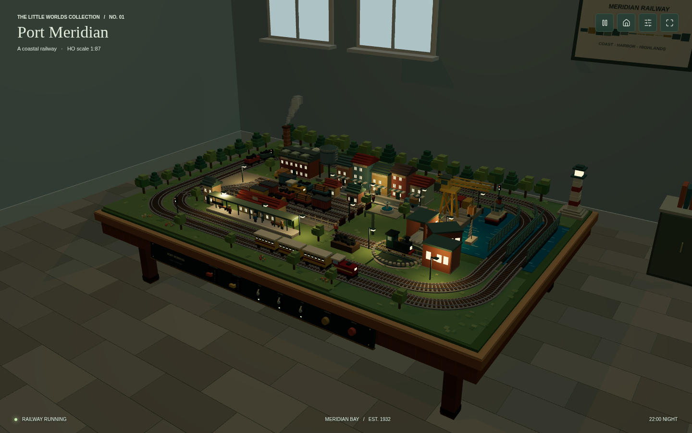

# Port Meridian

一个用 Three.js 搭建的体素风格模型铁路沙盘。整个应用只有一个 HTML 文件：木桌、房间、铁路、建筑、车辆、灯光和声音均由代码生成，不使用外部图片、模型或字体。

**[在线体验](https://zhx8702.github.io/port-meridian/)** · **[下载 Release](https://github.com/zhx8702/port-meridian/releases/latest)** · **[复现提示词](PROMPT.md)**



[观看演示视频（MP4，约 30 秒，5.9 MB）](port-meridian-demo.mp4) · [视频画面预览](video-preview.png) · [手机视图](mobile.png)

## 打开项目

1. 下载仓库 ZIP 并解压，或克隆仓库：

   ```bash
   git clone https://github.com/zhx8702/port-meridian.git
   ```

2. 用 Chrome 打开 `index.html`。
3. 等待 Three.js 加载完成，列车会自动开始运行。

不需要安装依赖、构建项目或启动本地服务器。首次打开需要联网，从 jsDelivr 加载固定版本的 Three.js 及其 OrbitControls 模块。

## 沙盘内容

- 两条运行环线、独立调速的客运与货运列车，以及往返作业的调车机车。
- 编组场、车站、带旋转转盘的机务段和机车库。
- 彩色小镇、工业厂房、水塔、喷泉与体素树木。
- 港口、曲线铁路桥、货物吊机、拖船、帆船和灯塔。
- 移动的汽车、货车、叉车、行人，以及烟雾、水面与喷泉动画。
- 昼夜循环、车厢和建筑灯光、街灯、铁路信号与旋转灯塔光束。
- 木桌正面的可拖动油门杆、开关与按钮。

## 操作

| 控件 | 功能 |
| --- | --- |
| 拖动场景空白区域 | 旋转观察视角 |
| 鼠标滚轮或双指缩放 | 拉近、拉远 |
| 桌面前侧两根控制杆 | 分别调整客运与货运列车速度 |
| LIGHTS | 开关建筑、车辆和线路灯光 |
| DAY / NIGHT | 开关自动昼夜循环 |
| CRANE | 启停港口吊机 |
| TURNTABLE | 让机车转盘旋转 45 度 |
| WHISTLE | 播放程序合成的汽笛声 |
| 右上角工具栏 | 暂停、恢复默认视角、打开控制面板、全屏 |

控制面板也可调节时间，并提供适合小屏幕使用的较大控件。拖动时间滑杆会关闭自动昼夜循环。

## 夜景



## 文件

- `index.html`：完整应用，包含样式、场景、交互和动画。
- `PROMPT.md`：原始生成提示词，以及补充实现和验收要点。
- `port-meridian-demo.mp4`：约 30 秒的无声演示，1280 × 800、24 fps、H.264。
- `desktop.png`、`night.png`：桌面视图预览。
- `mobile.png`、`mobile-controls.png`：移动端预览。
- `video-cover.jpg`、`video-preview.png`：视频封面与分镜预览。

## 技术与验证

使用 Three.js 0.170.0、OrbitControls、实例化体素几何体、Canvas 生成的标牌纹理和 Web Audio 合成汽笛。界面内嵌了少量 Lucide 图标，其许可说明保留在 HTML 中。

已在 Chrome 中检查桌面与手机尺寸的渲染、列车运动、实体控制杆和开关、转盘、灯光、暂停及控制面板；对两条完整运行环线进行了采样净空检查。演示视频通过完整解码和 Chrome 播放检查。
