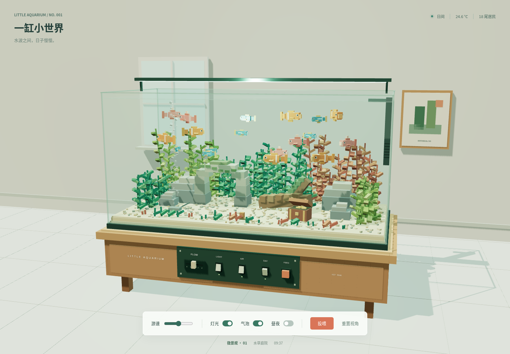
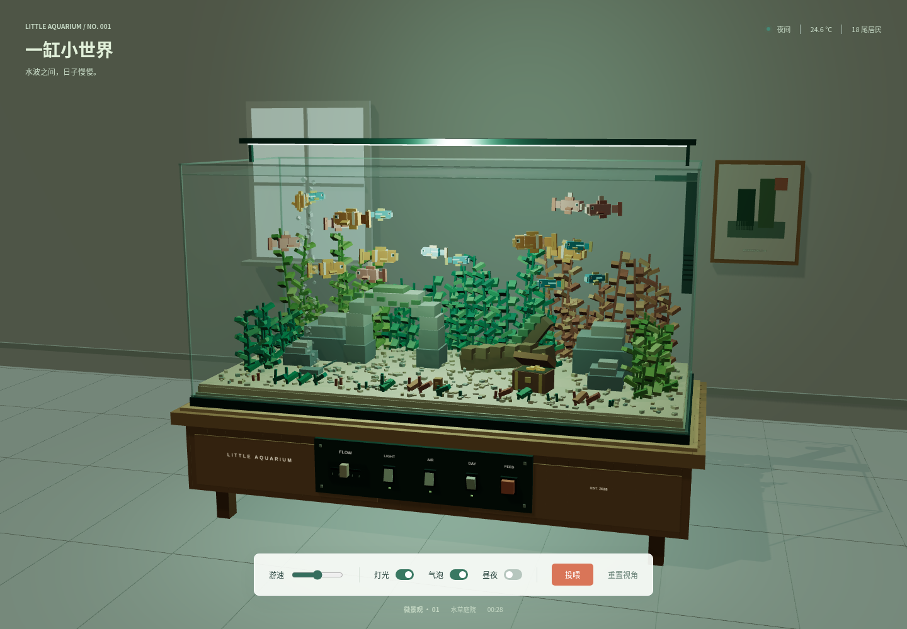

# 一缸小世界 / Little Aquarium

一个单文件 Three.js 体素鱼缸，放在房间中的木质底柜上，包含 18 条游动的小鱼、水草、石拱门、沉木、宝箱、气泡和昼夜灯光。

**[在线体验](https://zhx8702.github.io/port-meridian/aquarium/)** · **[返回 Demo 目录](../README.md)** · **[复现提示词](PROMPT.md)**

[V2 开发任务与优先级](../docs/aquarium-v2-tasks.md)：已整理真实养护、生态模拟和新手教程的开发计划，当前页面仍为 V1。

## 打开方式

用 Chrome 直接打开 `index.html`，不需要安装依赖或启动服务器。首次打开需联网加载 CDN 上的 Three.js `0.160.1`。鱼、家具、水草、模型、标签和材质均由文件内代码生成，没有外部图片或模型依赖。

## 操作

| 控件 | 功能 |
| --- | --- |
| 拖动空白区域 | 调整观察视角 |
| 滚轮或双指缩放 | 拉近、拉远 |
| 底柜 FLOW 推杆 / 底部游速滑杆 | 调整鱼群游速，设为 0 可暂停游动 |
| LIGHT / 灯光 | 开关水族灯 |
| AIR / 气泡 | 开关气泡 |
| DAY / 昼夜 | 开关自动昼夜循环，关闭后停留在当前时刻 |
| FEED / 投喂 | 投入食物，鱼群向食物聚集 |
| 重置视角 | 恢复默认取景 |
| 顶部 GPT-6 DEMOS | 返回作品目录 |

实体控制器与页面底部控件共享状态。鱼群通过限定游动范围和包围球分离避开硬质造景及其他鱼；植物和鱼尾持续摆动，水面、光斑及气泡保持动画。

## 夜景与手机

[手机竖屏预览](mobile.png)

## 验证

已通过 Chrome 与 Playwright 检查：桌面、390 × 844、320 × 568 和 844 × 390 视口，画布像素非空、鱼群运动、投喂、暂停、实体开关、速度推杆、视角恢复，以及昼夜和灯光变化。投喂过程连续采样的 90 帧中，鱼群包围球未相交。
