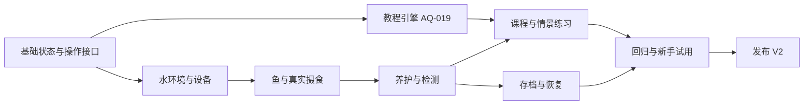

# 鱼缸 V2 开发任务

状态：需求与任务已整理，开发尚未开始。所有未勾选项均为待办。

基线：当前 [鱼缸 V1](../aquarium/index.html)。本计划来自关于真实养护、生态模拟与新手教程的讨论。

## 1. 版本目标与边界

V2 目标：一个能观察、能养护、会对操作产生合理反应的淡水水草缸。

首发采用鱼种兼容、设备齐全的成熟成鱼缸预设，完成以下闭环：

> 观察与检测 → 投喂 → 摄食与残饵 → 废物处理与水质变化 → 鱼的状态变化 → 设备调整与养护 → 复查与记录。

- 保留体素风格、房间、木质底柜和三维实体控制器；美术表现服务于实际状态。
- 保留 `aquarium/` 的 V1。V2 在 `aquarium-v2/` 独立开发，验收通过后再加入合集首页。
- 发布产物仍是可直接用 Chrome 打开的单个 HTML；CDN 库之外的场景素材由代码生成。
- 开发源码允许按模拟、渲染、交互、教程、存储分开维护；纯模拟逻辑应可脱离浏览器测试。若分文件，提供生成单文件产物的脚本。
- 首发不要求用户从空缸养水；成熟缸与新缸的区别必须在预设和教程中说明。
- 默认关闭页面后暂停演化，重新打开恢复保存的模拟时刻；实时离线补算属于 P1。
- 一条模拟时间轴驱动全部环境过程；本地时间用于初始化和时区显示，时间加速必须明确标注。
- 基础植物参与耗氧与光照相关的净氧气变化，但首发不包含完整生长、施肥和 CO2 注入系统。
- 首发支持观察应激、食欲与活力变化。完整疾病、死亡、繁殖和生长系统按后续任务实现。

## 2. 优先级

| 优先级 | 含义 | 发布要求 |
| --- | --- | --- |
| P0 | V2 首发必需，缺失会使养护闭环、新手使用或数据可靠性不完整 | 25 项全部达到验收标准后发布 V2 |
| P1 | 现实养殖的进一步覆盖，在稳定的基础模型上扩展 | 首发后按依赖分批交付，不等同于同时发布 |
| P2 | 更复杂的长期玩法、布景和视觉升级 | 基础模型和用户体验稳定后评估 |

优先级表示重要性，里程碑表示实现顺序。新手教程是 P0，不能作为收尾时补写的说明文档。

## 3. 里程碑与依赖

| 里程碑 | 任务 | 可交付结果 | 完成门槛 |
| --- | --- | --- | --- |
| M0 基础定义 | AQ-001～004 | 可测试的状态模型、时间轴与统一操作接口 | 同一初始条件和操作得到一致结果 |
| M1 水环境 | AQ-005～010 | 水量、水温、溶氧、废物、氮循环、水源与设备联动 | 正常运行及单因素变化符合参数依据和质量收支 |
| M2 鱼与场景 | AQ-011～015 | 自然游动、真实摄食、行为变化与场景反馈 | 鱼不穿模，食物和水质确实影响状态 |
| M3 养护与教学 | AQ-016～021 | 换水、维护、检测、日志、实体控件与互动教程 | 新手能完成一次完整养护流程 |
| M4 持续使用与发布 | AQ-022～025 | 存档、性能与回归验证、人工试用、正式入口 | V1 无回归，V2 本地和线上均可运行 |

AQ-019 在 AQ-003 完成后即可开始；课程内容随对应操作交付。测试应随各任务添加，AQ-023 负责整体验收，不把全部测试推迟到最后。

## 4. P0 开发任务

### M0：基础定义

- [ ] **AQ-001：确定成熟缸预设与参数依据**
  - 依赖：无。
  - 工作：明确缸体尺寸、实际水量计算、成鱼种类和数量、成体尺寸、活动水层、群居及兼容要求、设备类型与能力、水草类型、水源预设。核对鱼种和水质参数的可靠资料，记录来源、单位、适用条件及模型简化项。
  - 验收：交付可执行的预设数据和参数字典；不再按颜色冒充鱼种；容量综合考虑活动空间、鱼体大小、投喂与过滤负荷；没有无出处的精确安全阈值。

- [ ] **AQ-002：建立 V2 工程与状态边界**
  - 依赖：AQ-001。
  - 工作：新建独立 V2 目录；划分水环境、设备、生物、食物与废物、历史记录、教程、存档状态；分离纯模拟和 Three.js 展示。确定源码与单 HTML 产物的维护方式。
  - 验收：V1 与火车无需修改即可运行；模拟可无 WebGL 执行；状态能序列化；发布 HTML 不依赖本地模块请求或本地服务器。

- [ ] **AQ-003：统一时间轴与操作接口**
  - 依赖：AQ-002。
  - 工作：实现固定步长模拟、可复现随机种子、暂停、实时速率和受支持的加速档位；建立投喂、设备调整、检测、换水、清理等统一操作入口。画面、实体控件和教程调用同一入口。
  - 验收：帧率变化不改变相同模拟时长的结果；暂停不积攒待补算时间；加速推进全部生态过程；输入非法时返回明确结果且不部分修改状态；重复事件不会重复投喂或扣水。

- [ ] **AQ-004：定义单位、收支与模型测试基线**
  - 依赖：AQ-002、AQ-003。
  - 工作：统一 L、秒、摄氏度及物质量单位；含氮物内部采用一致的氮质量口径，界面标清浓度口径。建立正常成熟缸、无负荷、过量投喂、停泵、换水等可复现初始状态。
  - 验收：时间步收敛、输入边界和收支测试可运行；TAN-N 与 NH3 等口径不混用；各过程明确输入、输出、转化与移除途径，不用无依据的污染指数加减替代。

### M1：水环境与设备

- [ ] **AQ-005：水位、蒸发、补水与换水计算**
  - 依赖：AQ-003、AQ-004。
  - 工作：根据缸体、水位及排水体积计算实际水量；实现蒸发、排水和加入新水；按物质量与体积推导浓度，支持新水携带不同成分。
  - 验收：蒸发降低水位并保留模型内的非挥发溶质；补水不等同于移除污染物；换水移除相应水量中的溶质；空缸、满缸、超量排水与重复提交均正确处理。

- [ ] **AQ-006：水温、加热棒与房间环境**
  - 依赖：AQ-005。
  - 工作：模拟室温、设备功率、水量与热交换；加热棒提供目标温度、实际温度、启停回差和选定设备的低水位保护；换水参与温度计算。
  - 验收：设定温度不会瞬间改变水温；断电后按环境逐渐变化；水量与功率影响升温过程；混水和设备工作状态有对应测试。

- [ ] **AQ-007：溶氧与气体交换**
  - 依赖：AQ-005、AQ-006。
  - 工作：定义温度相关的平衡溶氧、水面交换、过滤回水与气泵扰动，以及鱼、微生物、水草的氧气收支。首发水草采用明确的简化光照响应。
  - 验收：气泡可见数量不是氧气数值的直接替代；开启气泵不使溶氧无限增长；缺氧、夜间和温度变化场景方向合理；气泵关闭不导致鱼瞬间异常。

- [ ] **AQ-008：食物、排泄、残饵与氮循环**
  - 依赖：AQ-004、AQ-005、AQ-007。
  - 工作：建立食物摄入、未摄入残留、排泄与分解的简化预算；实现总氨、亚硝酸盐、硝酸盐及生物过滤处理能力；反应速率受温度、氧气、负荷和菌群能力约束。
  - 验收：未摄入食物不会到点消失；残饵清理有实际移除量；成熟过滤能处理预设合理负荷；过量投喂、处理能力下降和换水的后果逐步发生，氮收支可核对。

- [ ] **AQ-009：水源处理、硬度与酸碱影响**
  - 依赖：AQ-001、AQ-005、AQ-006、AQ-008。
  - 工作：实现受支持的水源预设、余氯或氯胺处理状态、GH/KH 与缓冲模型；按适用淡水条件计算总氨中非离子氨的比例。首发限定模型支持的水源，不开放任意化学药剂和酸碱添加。
  - 验收：未处理与已处理新水可区分；静置不被统一视为去除氯胺；pH 不做算术平均；温度和 pH 改变时氨风险判断有对应依据；指标和阈值的单位一致。

- [ ] **AQ-010：过滤器、水泵和灯具实际联动**
  - 依赖：AQ-007、AQ-008、AQ-009。
  - 工作：分离机械截留、生物处理和实际水流；模拟滤材积污与流量变化；设备具有设定值、实际输出和工作状态。房间日夜、鱼缸照明计划和手动开关分别建模。
  - 验收：过滤器积污会影响实际流量；手动关闭设备影响对应过程；白天可关缸灯、夜间可开灯；基础维护不会无条件恢复全部生物处理能力；设备参数变更进入日志。

### M2：鱼、摄食与场景反馈

- [ ] **AQ-011：真实鱼种与个体数据**
  - 依赖：AQ-001、AQ-002。
  - 工作：用已核对的兼容成鱼预设建立个体；包含尺寸、活动水层、群体偏好、食性、摄食需求、舒适环境范围及状态；基础螺类有自己的活动、摄食与排泄数据。
  - 验收：鱼种外形、名称和行为相符；每条鱼有稳定 ID；初始数量与负荷一致；螺不作为让废物凭空消失的清洁工具。

- [ ] **AQ-012：自然游动、群游与空间避障**
  - 依赖：AQ-003、AQ-011。
  - 工作：评估成熟 steering/空间查询库的适配与许可，确定实现方案；加入探索、群体协调、平滑转向和目标寻路；覆盖玻璃、造景、水面及其他生物，考虑身体与鱼尾的实际运动范围。
  - 验收：正常、聚食、休息和水位变化时不穿模或明显瞬移；鱼有符合鱼种的活动区域；固定种子下可复现；避障不会将鱼推到缸外或挤入造景。

- [ ] **AQ-013：真实投喂与逐粒摄食**
  - 依赖：AQ-008、AQ-011、AQ-012。
  - 工作：提供份量选择；食物有可追踪的数量或质量、位置和状态；鱼根据食欲接近并摄食，饱食度改变摄食倾向；残饵沉积并进入废物模型。
  - 验收：一粒食物不会被重复食用；摄食与营养及废物预算一致；鱼饱后不会持续抢食；多喂会留下残饵；暂停、恢复和存档不会复制或丢失食物。

- [ ] **AQ-014：休息、应激和异常行为**
  - 依赖：AQ-006～010、AQ-011～013。
  - 工作：根据光照、环境偏离、食欲和近期操作驱动正常活动、休息、躲藏、呼吸及应激表现；逐渐积累和恢复状态，保留鱼种差异。
  - 验收：夜间活动符合预设鱼种；环境恢复后状态逐渐改善；不能仅凭浮头或躲藏直接确定病因；提示能列出应检查的条件，首发不宣称具备完整疾病诊断系统。

- [ ] **AQ-015：把真实状态映射到场景**
  - 依赖：AQ-005～014。
  - 工作：显示真实水位、水流方向、植物摆动、残饵、积污、鱼的行为和设备指示；保留当前房间、底柜与水下造景风格，整合实体控制器位置。
  - 验收：画面和数据一致；清澈度不等同于全部水质合格；关闭设备、换水和清理都有可辨认反馈；桌面与手机完整取景，控制面板不遮挡主要操作对象。

### M3：养护、观测与新手教程

- [ ] **AQ-016：完整养护操作流程**
  - 依赖：AQ-005、AQ-009、AQ-010、AQ-013。
  - 工作：实现准备新水、检查处理状态和温差、选择排水量、换水或补水；提供残饵与底部沉积清理、前置或机械滤材维护，以及与生物滤材维护有区别的操作。
  - 验收：每项操作有可计算的移除或加入量、实际结果和记录；混水后指标由模型产生；连续点击不会重复执行；补水、换水、不同滤材维护不能共用一个“全部恢复”实现。

- [ ] **AQ-017：观察、检测与趋势记录**
  - 依赖：AQ-006～010、AQ-014、AQ-016。
  - 工作：提供个体观察、设备持续读数、按次水质检测和养护日志；检测结果记录指标、单位、采样时间及适用参考范围；支持查看时间趋势。
  - 验收：历史检测值不会伪装成实时传感器；初学者能先看到关键状态再展开术语；能关联投喂、换水、维护前后的变化；记录容量受控且时间加速不导致无限数据增长。

- [ ] **AQ-018：重做实体控件与移动端操作**
  - 依赖：AQ-003、AQ-010、AQ-015～017。
  - 工作：将直接控制鱼游速的推杆改为水流控制；单独提供模拟暂停与时间速率；加入份量、照明计划、设备设置和养护入口；设备设定值与实际值分开显示。
  - 验收：三维控件和页面控件共享同一状态；操作可由鼠标、触摸和键盘完成；拖动视角不误触投喂；窄屏文字和提示不溢出；按需展开面板，观察时仍以鱼缸为主。

- [ ] **AQ-019：互动教程引擎与进度状态**
  - 依赖：AQ-003；在 M1 期间即可开始。
  - 工作：建立按前置条件和实际结果推进的步骤模型；支持对象高亮、简短提示、跳过、退出、继续与重播。课程操作走正式操作接口，练习缸与长期鱼缸的状态隔离。
  - 验收：步骤完成由结果判定，不能仅靠点击“下一步”；退出教程可继续使用鱼缸；中断和恢复不会重复投喂或换水；练习重置不覆盖用户长期存档。

- [ ] **AQ-020：首次使用六步课程**
  - 依赖：AQ-011、AQ-013、AQ-016～019。
  - 工作：依次交付认识鱼种、检查设备、少量投喂、一次检测、一次部分换水、查看养护记录和安排的课程。初始为明确标注的成熟缸，讲解首先围绕当前操作和养护原因。
  - 验收：目标体验约 5～8 分钟，以人工试用结果校准；观察、设备及投喂课程可先独立交付；相关时间快进有标识，不暗示现实氮循环或开缸在几秒内完成；首次打开可直接观赏或选择引导。

- [ ] **AQ-021：情景练习、操作提示与基础手册**
  - 依赖：AQ-017、AQ-019、AQ-020。
  - 工作：至少提供过量投喂、过滤流量下降、蒸发后补水、水温异常四个独立练习；补齐“现象 → 可能原因 → 检查 → 操作 → 复查”的手册及术语解释；提示按实际状态触发。
  - 验收：每个练习可恢复、重试，具有已验证的初始条件和成功标准；不以唯一症状锁定病因；用户能解释补水与换水的区别；已掌握操作不反复弹窗；移动端提示不遮挡目标。

### M4：持续使用与发布

- [ ] **AQ-022：存档、恢复与时间边界**
  - 依赖：AQ-002、AQ-003、AQ-017、AQ-019。
  - 工作：自动保存鱼缸、设备、食物、历史和教程进度；实现版本化结构、校验、导入导出及重置保护；首发按关闭页面暂停的规则恢复。处理后台节流、存储不可用、损坏数据和旧版本数据。
  - 验收：刷新后完整恢复同一缸状态；后台计时不依赖渲染帧数；重置练习不影响长期鱼缸；本地 HTML 存储不可用时可导出且反馈明确；导入失败不破坏当前状态。

- [ ] **AQ-023：模型、交互、性能与兼容性回归**
  - 依赖：AQ-004～022，测试随对应功能持续添加。
  - 工作：整合收支和时间步测试、正常与异常场景、鱼群全活动范围净空、所有维护操作、教程跳转和存档恢复测试；检查 CDN 失败、WebGL 失败、触摸与键盘操作；建立明确设备条件下的性能基线。
  - 验收：桌面及至少 390×844、320×568、844×390 视口截图与画布像素检查通过；长时模拟无数值失控、记录或对象无限增长；同一模拟时长在不同受支持加速档位内结果符合误差约定；性能目标和实测设备公开记录，不用软件渲染环境推断普通 GPU 帧率。

- [ ] **AQ-024：无养鱼经验用户试用与修订**
  - 依赖：AQ-020～023。
  - 工作：安排真实新手完成首次引导和一个异常练习，记录卡点、误解、重复操作与完成情况；根据反馈修订文案、操作顺序和提示。此项为人工验收，不由自动化脚本替代。
  - 验收：试用者能独立完成合理投喂、设备检查和部分换水，能区分补水与换水，并知道异常时先观察与检测；若尚未获得真实试用反馈，任务保持未完成并记录已有自查结果。

- [ ] **AQ-025：V2 产物、文档和 Pages 发布**
  - 依赖：AQ-001～024。
  - 工作：生成独立 `aquarium-v2/index.html`；更新操作说明、参数与模型范围、提示词、预览图和版本记录；在合集添加 V2 独立入口，保留 V1；提交并验证 GitHub Pages 部署。
  - 验收：本地直接打开和线上子路径均能运行；下载的单 HTML 能独立使用；新旧入口可比较并返回目录；部署对应已验收提交；仓库文档清楚区分已实现功能和后续计划。

## 5. P1 后续任务

- [ ] **AQ-101：从零开缸与过滤系统成熟**
  - 依赖：AQ-008、AQ-009、AQ-019。
  - 内容：增加空缸布置、水源处理、菌群建立、检测和逐步增加负荷的流程；新增开缸课程。
  - 验收：新缸与成熟缸有实质不同；成熟程度由环境和负荷过程产生，不以一个固定倒计时自动完成。

- [ ] **AQ-102：新鱼入缸、兼容性与隔离观察**
  - 依赖：AQ-011、AQ-014、AQ-022。
  - 内容：增加鱼种与容量校验、运输容器、适应、隔离观察和进入主缸的流程。
  - 验收：兼容性考虑环境、性情、成体空间和群居数量；新鱼有适应状态；隔离缸与主缸水体独立。

- [ ] **AQ-103：植物生长、枯叶与修剪**
  - 依赖：AQ-007、AQ-008、AQ-010。
  - 内容：增加植物种类、生长、适应期、老叶脱落、修剪及对光照、养分和可用碳源的响应。
  - 验收：生长和移除有明确物质量去向；枯叶会影响有机物负荷；植物不会无限穿出缸体或侵占全部游动空间。

- [ ] **AQ-104：藻类与长期底部生态**
  - 依赖：AQ-008、AQ-010、AQ-103。
  - 内容：实现玻璃、石头和植物表面的藻类增长、清理、再生及螺类取食；扩展沉积和腐殖过程。
  - 验收：藻类由光照、养分和环境共同影响；除藻与螺类取食不无条件清零污染；清理方式有不同移除效果。

- [ ] **AQ-105：长期健康、疾病与死亡后果**
  - 依赖：AQ-014、AQ-017、AQ-022；传染与隔离部分还依赖 AQ-102。
  - 内容：扩展持续应激、健康恶化、恢复、选定疾病过程、隔离管理，以及死亡个体清理和分解。
  - 验收：症状不对应单一必然病因；健康变化具有合理时程；清理与未清理的物质预算不同；知识内容和参数有依据，教程练习仍可恢复。

- [ ] **AQ-106：停电、故障与恢复演练**
  - 依赖：AQ-006、AQ-007、AQ-010、AQ-021。
  - 内容：增加受控的停电、堵塞、设备失效和恢复情景；按预设设备类型模拟恢复条件。
  - 验收：风险与持续时间、温度和氧气状态有关，不在停电瞬间重置菌群；实际输出、开关状态与故障状态可区分；有可复查的处理记录。

- [ ] **AQ-107：可选实时离线演化**
  - 依赖：AQ-022、AQ-023。
  - 内容：在默认离线暂停之外提供明确选择的实时模式；实现补算上限、摘要、时间异常处理和跨时区规则。
  - 验收：用户知道关闭页面后的行为；补算与正常推进在支持范围内一致；篡改系统时间、长时间离线和连续恢复不会重复结算或锁死页面。

- [ ] **AQ-108：进阶课程和个性化养护建议**
  - 依赖：AQ-017、AQ-019，以及对应已完成的 P1 功能。
  - 内容：补齐开缸、滤材维护、新鱼入缸、植物与藻类、长期异常处理课程；依据当前预设、检测和实际负荷给出检查建议。
  - 验收：建议能说明对应状态和依据，不向所有鱼缸套用固定换水周期或投喂量；课程仅引用实际实现的功能。

## 6. P2 扩展任务

- [ ] **AQ-201：生长、繁殖与育幼**
  - 依赖：AQ-102、AQ-105。覆盖体型和负荷随生长变化、性别与繁殖条件、卵或幼鱼阶段、育幼环境及容量管理。
  - 验收：后代数量受条件和空间限制；体重、摄食与污染负荷联动，不能无限增殖。

- [ ] **AQ-202：自由建缸与造景编辑器**
  - 依赖：AQ-005、AQ-012、AQ-023。开放尺寸、底砂、造景、植物和设备摆放；实时重新计算水量、可用空间和进出水布局。
  - 验收：编辑后重新校验所有活动范围；阻止无可用游动空间的布置；撤销重做、保存和导入保持模型一致。

- [ ] **AQ-203：进阶水草缸与化学调节**
  - 依赖：AQ-009、AQ-103、AQ-104。扩展动态 CO2、肥料、养分限制与受支持的水质调节模型。
  - 验收：各添加物有单位、收支、适用范围和反馈；不以单个滑杆直接设定最终 pH 或植物生长结果。

- [ ] **AQ-204：写实渲染与环境声音**
  - 依赖：AQ-015、AQ-023。评估玻璃折射、水面、鱼体材质、光照和程序生成设备声音；提供画质与声音选项。
  - 验收：性能预算明确，视觉变化不改变生态结果；鱼、设备和控件仍清晰可辨；继续遵守单文件和素材约束。

## 7. 需求覆盖索引

| 讨论的需求 | 对应任务 |
| --- | --- |
| 真实规格、水量、容量和鱼种兼容 | AQ-001、005、011、102 |
| 自然游动、群游、休息、应激与避障 | AQ-012、014、015 |
| 实际投喂、残饵、排泄、螺与缸底生态 | AQ-008、011、013、016、104 |
| 温度、加热、水流、过滤、氧气与氮循环 | AQ-006～010 |
| 水源处理、pH、GH/KH、氨风险 | AQ-009 |
| 蒸发、补水、换水、清理与滤材维护 | AQ-005、010、016 |
| 昼夜、灯光计划和设备工作状态 | AQ-003、010、018 |
| 检测、趋势、日志与原因排查 | AQ-017、021、108 |
| 入门教程、随手提示、手册与独立练习 | AQ-019～021、024 |
| 存档、导入导出、后台和离线时间 | AQ-003、022、107 |
| 新缸、适应与隔离、健康和死亡 | AQ-101、102、105 |
| 水草、枯叶、藻类、CO2 与施肥 | AQ-103、104、203 |
| 设备故障与停电恢复 | AQ-106 |
| 长期生长、繁殖、自由造景与写实画面 | AQ-201～204 |
| 单文件、移动端、性能、验证和版本发布 | AQ-002、018、023～025 |

## 8. 开始开发时的执行约定

1. 从 AQ-001～004 开始，先交付参数与状态模型、时间轴及可运行测试。
2. 每个任务完成后更新勾选状态，并记录提交、测试证据和仍存在的限制；只完成部分内容时保持未勾选。
3. 在水环境任务推进时接入 AQ-019，不等全部画面完成后才设计教学。
4. 每个里程碑保留可运行版本；模型和教学验收均通过后再进入正式发布。
5. 改动范围超出任务、参数依据发生变化或影响已有教学结论时，同步更新本计划与相关测试。
6. 新功能上线前，合集首页不把未完成的 V2 展示为可用作品。
